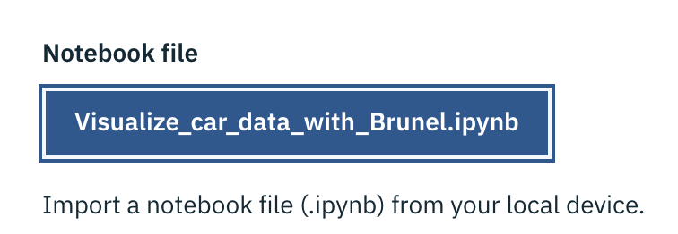

# Lab 2: Watson Studio Visualizations
In this lab we will cover several data visualization capabilities provided by **IBM Watson Studio**:
* Two **IBM Watson Studio** programatic visualization add-ons on top of the regular support provided by Jupyter Notebooks and its cohort of visualization librairies (`matplotlib`, `seaborn`, `bokeh`, `ggplot`, ...):
  * **Brunel**
  * **PixieDust**
> **Note:** Jupyter Notebook is a web-based interactive computational environment for creating  documents which contain an ordered list of input/output cells which can contain code, text (using Markdown), mathematics, plots and rich media, usually ending with the ".ipynb" extension..  

In this lab you will open and run several Notebooks written in Python (one of the several programming language available) and running on a pre-configured Python runtime environment.

## Brunel Visualizations
Brunel is an IBM-contributed open source tool designed to generate powerful visualizations with no 'plumbing' or boilerplate code.   
Brunel will allow to build complex displays from `Pandas DataFrames` with only a single declarative line describing the display.

> **Note:**  `pandas` is a software library written for the Python programming language for data manipulation and analysis. In particular, it offers data structures known as `DataFrames`and operations for manipulating numerical tables and time series.

Brunel has been integrated as an add-on to Jupyter Notebooks and is included in the Watson Studio environment setup.  

> If you are interested of understanding more about Brunel, feel free to explore the following resources:
> * Brunel GitHub repo: <https://github.com/Brunel-Visualization/Brunel>
> * Brunel documentation: <https://brunel.mybluemix.net/docs/>
> * Brunel Visualization Tech Talks: https://developer.ibm.com/code/videos/brunel-visualization-tech-talk/

The hands-on will be driven by the `Visualize_car_data_with_Brunel_cleared.ipynb` notebook, using data from the `cars.csv` file.

### Lab Setup
* From your `WatStud_Workshop` project's `Assets` tab, add the `cars.csv` file as Data Asset if not already part of your `Assets`
* Create a new Notebook from the file  `Visualize_car_data_with_Brunel.ipynb`  

* Select the default runtime environment which should be something like `Default Python 3.6 Free (1 vCPU and 4 GB of RAM)`:

* Follow the instructions within the notebook and come back to this material once completed.
* Note the keyboard shortcuts needed to run `Code Cells` within a Notebook which can be viewed from the `Help Menu > Keyboard Shortcuts` inside the Notebook.

## PixieDust Visualizations
### What is PixieDust?
**PixieDust** is an IBM-initiated open source framework for interactively exploring data sets within Jupyter Notebooks.   

### Lab introduction
The notebook used in this hands-on lab makes use of **PixieDust** capabilities to handle a Spark dataset, such as direct downloading of dataset from source URL, and interactive visualization.

The notebook is about analyzing traffic incidents from the city of San Francisco, based on the Open Data set provided by the authorities.

* Create a new notebook from file, selecting  `pixiedust-traffic-analysis_pandas.ipynb` as source, and selecting the same runtime as in the previous notebooks, e.g. `Default Python 3.6 Free`.
* Follow the instructions in the notebook. You will notice that the notebook uses the **PixieDust** display widget to guide you through interaction with the data, and therefore there is not a lot of actual code used in this notebook.
