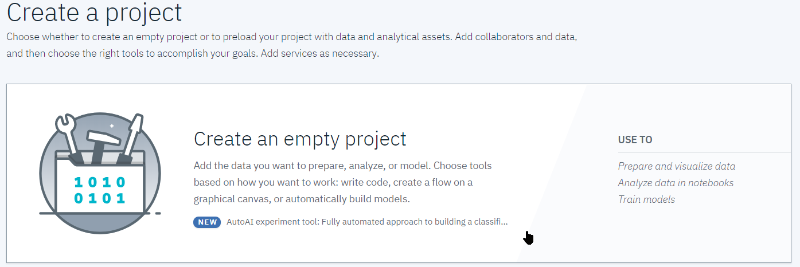
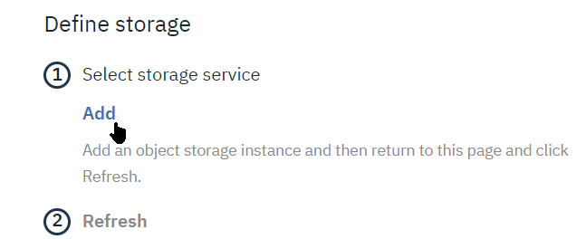
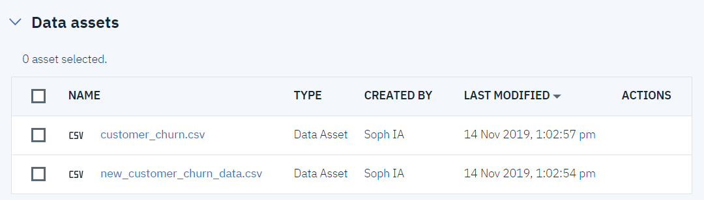
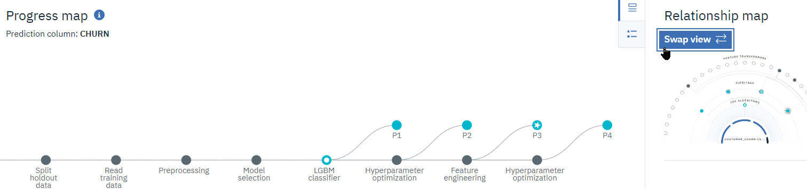

# Tooling for non-AI experts - Watson Studio AutoAI

---
Get experience with **IBM Watson Studio**'s no-code ***AutoAI*** tool by creating a binary classification Machine-Learning model to evaluate the risk that a customer might leave your service.

**Duration:** 30 minutes

---

In this tutorial, you will use **IBM Watson Studio**'s **AutoAI** to train and deploy a machine-learning model within a low-code/no-code paradigm.

# Introduction
## Objectives
In this hands-on lab, you will learn how to create, train and deploy a Machine Learning model with a no-code/low-code paradigm, leveraging Watson Studio's AutoAI tool.

## Applying supervised Machine Learning
In supervised Machine Learning, a model is trained from historical data. The training phase is fed with records representing past observations of a dataset's behavior, and a model representing the beahvior of this dataset is produced.

## Telco *Customer Churn* use-case
The use case that we will tackle here is to predict whether a customer is likely to switch telephony operator or not. We have at our disposal a dataset, `customer_churn`, which represents past observations of customers' `CHURN` behavior, alongside defining characteristics of each customer, such as demographics data on age, gender, number of children, and business domain data pertaining to its characteristics as a customer, such as plan, payment method, average usage, ...

Once the model will have been trained, it can be used to predict the `CHURN` indicator for new customer records. This can then be used for example to orient actions to be taken when the customer is in contact with a call center, or to drive a marketing customer retention campaign.

## Predictive Model setup
The value that we want to predict is represented by a string which can take two values or classes, `T` or `F`. This means that we are facing a *Binary Classification* type of ML problem.   
There are many possible implementations of algorithms to solve Classification problems, and Watson AutoAI will help us determine the implementation which has the best accuracy for the training set.   
Without going into details, each type of algorithm has several accuracy measurement indicators which can be chosen depending on the overall 'shape' and constitution of the dataset, as well as the intended use of the prediction.   
For binary classification, a standard metric is called AUC-ROC (for Area Under Curve-Receiver Operator Characteristics), and measures how well a model is able to predict both Positives and Negatives. Other indicators sur as AUC-PR (AUC-Precision Recall) measures how well a model is able to identify Positives, even if Negatives prediction is less accurate.

## Hands-on Lab overview
The instruction below will guide you in achieving the following tasks:
  * Load a data set into the project
  * Use **IBM Watson Studio AutoAI** to train, test, and evaluate a machine-learning model
  * Deploy the trained model
  * Use the deployed model to generate predictions on a new dataset
---


# Hands-on Lab steps

> Note: setup should already be done so you can skip to step [A]. Note that if you already have a project created, you can reuse it, **it is not required to recreate a new one.**

## [0] Setting up Watson Studio within IBM Cloud
This section is a one-time setup to add the *Lite* version of Watson Studio to your IBM CLoud account.    
Watson Studio Lite version is fully functional but has some capacity limits, which will not be exhausted by running this lab.

Watson Studio is an IBM Cloud service, so in addition to the IBM Cloud account setup, you will need to create the Watson Studio instance. In addition, Watson Studio makes use of additional data and AI related services from the IBM Cloud platform, so we will create some artifacts for use within Watson Studio at runtime:
1. Create a Watson Studio service instance
1. Create a Watson Studio Project for the workshop.
1. Provision a set of additional services
1. Load data files into the project as Data Assets

### [0.1]. Accessing IBM Cloud
This section assumes that the Master Class pre-work has been completed and that you have access and are logged into an IBM Cloud account at https://cloud.ibm.com.    
If not, follow instructions in [SophIA_WatsonStudio_Setup_v9.pdf](SophIA_WatsonStudio_Setup_v9.pdf)

### [0.2]. Creating a Watson Studio instance
From IBM Cloud, we will instanciate a Watson Studio service, as the anchor for the toolset within IBM Cloud. Note that this is a one-time setup, only one instance of Watson Studio per region needs to be created.
1. Log-in to you IBM Cloud account's dashboard (https://cloud.ibm.com)
2. Click the `[Create Resource]` button at the top right 
3. In the search filter field, type `watson studio`. This should reveal the lite services having the `watson studio` word in their description.  and click the `Watson Studio` tile.   
> NOTE: Make sure to use **`Watson Studio`**, and ***not*** *`Knowledge Studio`*
4. You are taken to the service creation page. Although it is possible to create an instance of Watson Studio in either `Dallas`, `London` or Frankfurt data centers, it will be more convenient to use `Dallas` for the purpose of this masterclass. You can change the service name suffix or keep the suggested name. Keep the `Lite` service plan and click the `[Create]` button.

NOTE: In the rest of the labs, if you created your Waston Studio instance in the `Dallas` data center, you will use the plain URLs without prefix, e.g. `dataplatform.ibm.com`, but if you created in the `London` data center, you will need to use the `eu-gb` URLs, e.g. `eu-gb.dataplatform.ibm.com`, or `eu-de.dataplatform.ibm.com` for `Frankfurt` center.

## [A] Building a Predictive Model using AutoAI
### [A.1] Project setup
Now that we have put in place the infrastructure to work with Data & AI, we can start creating a project for a specific data handling project.
1. If not already signed-in, login to your Watson Studio environment within IBM Data Platform. For this, go back to the IBM Cloud dashboard, select the `Watson Studio` service instance, and click the '[Get Started]' button .  
The first time you start the Watson Studio UI, you will be asked to confirm some details, click `[Get Started]`    
Note that you can also go directly to the service's Cloud Web UI using the URL for the dat acenter where the service has been created, either
* https://dataplatform.ibm.com/projects?context=analytics for 'Dallas'
* https://eu-gb.dataplatform.ibm.com/projects?context=analytics for 'London'
* https://eu-de.dataplatform.ibm.com/projects?context=analytics for 'Frankfurt'
Create a new project using the `Create a Project` button tile     
Then select a `Create an empty project` configuration.    
1. Name this new project e.g. `SophIA2019`.   
Watson Studio stores its file-like artifacts into an instance of `Cloud Object Storage`, we will create a COS service instance at this stage:
   1. Click on `[Add]` in the Define Storage section 
   1. Select the Lite Plan  and click `[Create]`
   1. Accept defaults 
   1. Back to the Project creation page, select Refresh, 
   1. The newly created Object Storage service instance should be preselected 
   1. Finally, click **Create** for the project:
   
Note that COS instance needs to be created only once, it will hold projects' artifacts in separate buckets for each.

You may think of Cloud Object Storage as the file system for the Cloud.

### [A.2] Data Preparation for the Training phase
In this section, we will prepare the data to be used for model training and verification.
The data files have been stored in the Box folder, and should be downloaded to your laptop first.
1. In your project, switch to the `Assets` tab.
1. In this tutorial, you work with a data sets stored as project artifacts. **Click the Find and add Data** icon which looks like a `10 01` button . It will open the file management sidebar.  
1. From the **Load** tab, Click **Browse** to select from your local file system.
Navigate to the lab files folder and select both `customer_churn.csv` and `new_customer_churn_data.csv` files and click **Open**.   
1. The two files will now be listed in the Data assets section: 
Alternatively, you can drag and drop a file directly into the sidebar.
The file is added to your local data sets in your project.

### [A.3] Predictive Model training with AutoAI
We will now create a model by using the IBM Watson Studio's AutoAI low-code model builder.

1. Use the `[(*) Add to Project]`  button to bring up the artefact creation panel.
1. Create an **Auto AI Experiment** through the button 
1. On the `Create an AutoAI experiment` page, enter a name for the model, `CustomerChurnPredict` for example 
1. An **IBM Watson Machine Learning Service** is required:
   1. Click on  `Associate a Machine Learning service instance` 
   1. Create a new Lite/Free plan instance: 
   1. Once created, switch back to the AutoAI creating tab and click `[Reload]`  to select your newly created instance.
1. Click `[Create]` button at the bottom right
1. On the "Add data source" page, you can select the data asset to use to create your model.
   * Since we have uploaded the file as a data asset already, we'll use 
   * Highlight `customer_churn.csv` and `[Select asset]` button 
   * You could have used the browse button to upload `customer_churn.csv` if it had not been done earlier in this lab.
1. We will now configure the AutoAI input to drive the machine-learning predictive model construction.
From the **Select column to predict** list, select **CHURN**. This is the column that contains the historical observations and thus the outcome to predict 
The columns contain the attributes on which the machine learning model will base predictions. All columns (features) that are not part of the prediction will be possible canditates for the prediction. We will see later on that AutoAI can help determine which ones are more pertinent than others.
1. As you can see, the AutoAI model builder selects **Binary Classification** by default as the type of model to build, because the `CHURN` column has been introspected and found to contain only two values, `T` and `F`. The model also selects `ROC AUC` as the metric for model evaluation. You could change those defaults under the `[Experiment settings]` button.
1. Now click on the `[Run experiment]` button .
1. The canditate models will display in the pipeline leaderboard as they are evaluated , and ranked according to the selected metric (ROC AUC here by default). The ROC (Receiver Operating Characteristic) and PR (Precision Recall) Area Under Curve (AUC) are metrics used to evaluate the accuracy of a model's true positive and true negative predictions, evaluated on the test subset. The closer they are to 1.0, the better the sensitivity of the model.
1. This will trigger **AutoAI**'s evaluation of the possible algorithms implementations and their configurations in order to select the best fiting one. The model evaluation and selection process is displayed as it executes (you may want to use the `[Swap View]` button) 
1. Once completed, the relationship map shows the various paths that have been explored, highlighting the most accurate one as **Top performer**, hovering over the corresponding icon will reveal the selected algorithm (*LGBM CLassifier* here), and which *Feature Engineering* has been applied 
1. We can get more details on a given canditate model by expanding it: . You will notice the AUC ROC plotout, and the metric computations on the cross-validation data set, which has been used for training, as well as the holdout, which has never been seen by the training and gives an idea of the atcual accuracy of the model.
1. Looking deeper into the selected model yields more insights on your data set. Select the top pipeline .
1. This opens the model details. Several tabs are of particular interest:
  *  The _Confusion Matrix_  shows more details on the model evaluation on the Holdout set. Here we can see that out of the 10% of rows set aside for the holdout set, in this case 206 rows, only 4 have been predicted wrong, for an overall accuracy of 98.1%.
  *  The _Features Transformations_  tab shows which features **AutoAI** has generated, ranked by order of importance.   
  It is interesting to find out that the sum of `LongDistance` and  `International` calls appears as a relevant combined feature.
  * The _Feature Importance_  shows which factors influence the most the `CHURN` target, in this case `Age`, `Est Income`, `LongDistance` account for 16%, 145 and 12% of the predictive power.
1. Lastly, we will select the best performing model (which usually has the best AUC ROC), and use the `[Save as model]` button to retain it 
1. When you're prompted to confirm, click **Save** again 
1. Switching back to your project's assets list, you will now find the saved trained model in the Models section: 

Using `View in project` link , you can be returned to the model's summary page, where your new model is shown.

>> **You now have a trained model, next you will deploy the model to test on out-of-sample data.**

## [B] Deploy and test the trained model
Before you can use your trained model to make predictions on new data, it must be made accessible from an Application Programming Interface (API).   
This step is called **Deployment**, and it hinges between development and operations.

### [B.1] Deploying the AutoAI predictive model
1. From the models list, locate your model and select the `Deploy` action 
1. You are taken to your model's *Deployments* tab. Click **Add Deployment (+)** link on the upper-right section of the pane 
1. On the **Create Deployment** page, give a name and a description to your deployment, e.g. `CustomerChurnDeploy`.
1.  Clicking `[Save]` will deployed the model as a REST endpoint, as defined by **Web service** selection:.
1. When model deployment is complete, the STATUS turns to `ready`, and from the **Actions menu**, click **View**: 
   If you are a developer, you may want to review the information in the **Implementation** tab.
   > The **Code Snippets** shows examples of how to use the REST endpoints from several environments, and can be passed on to you application developer to integrate the deployed model into a business application. We'll come back to it in the last section of this lab.
1. We are now able to the model prediction: go to **Test** tab.  
1. Enter data in all the fields for a sample record from the data set.   
 For example, get data values from one line of the `new_customer_churn_data.csv` file, e.g:
```
8
F
M
0
19732.80
N
50.67
24.81
0
22.44
0
CC
FreeLocal
Standard
47.25
3
```
1. Note that alternatively, it is less tedious to switch to the raw JSON input using  and copy the data from here and paste into the `Input JSON Payload data`:
``` JS
{"input_data":[{"fields": [ "ID", "Gender", "Status", "Children", "Est Income", "Car Owner","Age", "LongDistance", "International", "Local", "Dropped","Paymethod", "LocalBilltype", "LongDistanceBilltype","Usage", "RatePlan"],"values": [[ 6, "M", "M", 2, 29616, "N",49.42, 29.78, 0, 45.5, 0,"CH", "FreeLocal", "Standard",75.29, 2]]}]}
```
1. To test the model and make a `CHURN` prediction on this data, click the `[Predict]` button: 
1. The system will invoke the Watson Machine Learning REST endpoint for the AutoAI model, you will get the resulting prediction buffer, looking like: 
Here the prediction is that customer `CHURN` is `F` with a 98.5% probability.
1. Additionally, you can test several other records taken


## [S] Optional Stretch Lab: run the model from a Python notebook
> **Note**: This section assumes that you have some proficiency in application development and will be comfortable dealing with some code!

The model just deployed can be invoked from any development environment that supports invoking REST endpoint, in the world of Data Science, the first intent will often be a Jupyter notebook coded in the Python language.

This is implemented in the `Lab-Stretch-RunModelFromNotebook.ipynb` notebook. This can be a first step towards integrating a ML model into an application.

Before creating the notebook, you will need to take note of the WML scoring REST endpoint for your model, and the Watson Machine Learning Service credentials:
**** [S.1] REST Scoring endpoint
1. Select the **Deployments** tab in your project 
1. Select the `CustomerChurnDeploy` created earlier, and switch to the
1. Select the `Implementation` tab, and copy the value of the `Scoring End-point`:

1. Paste this value in e.g. a notepad file on your laptop.

**** [S.2] Watson Machine Learning credentials
1. From the Hamburger menu (top left), select the `Services` menu and then the `Watson Services`

1. In the `Machine Learning` section, locate your service, and select `Manage in IBM Cloud` from its menu 
1. Select the `Service Credentials` tab 
1. Expand `View Credential`, and use the copy button (top right), and then paste them to a text file on your computer (using e.g. `notepad` on windows).

We will use these values in a python notebook shortly.

#### [S.3] Creating the notebook
Now you can switch back to Watson Studio and add a notebook from file:
1. From your project's Asset tab, use the `(+) Add to project` button to add a notebook
1. Use the `From file` tab and `[Choose file]` button to load the `Lab-Stretch-ScoreModelFromNotebook.ipynb` notebook file
1. Select a `Default Python 3.6 Free` environment from the 
1. Click `[Create Notebook]`, and follow the instructions within the notebook.

#### [S.4] Executing the notebook
Instructions are within the notebook itself, in comment cells.

In essence, you will execute the notebook's code cells using the `[(>) Run]` button.   
Minimal changes will be required to specify the proper REST endpoint URL and WML credentials.

# Conclusion
You completed the lab for Training and Deploying a model using the **IBM Watson Studio**'s ***AutoAI*** model builder.
