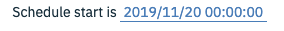
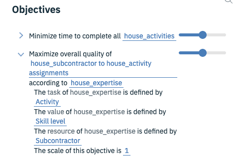

# Prescriptive Analytics Lab - House Construction Scheduling

## The problem
You need to plan and schedule activities and subcontractors for a house construction project. Your schedule must start on a particular date. All the activities (masonry, carpentry, plumbing and so on) must be scheduled and there is a specified order of activities that must be respected (for example windows cannot be put in until the roof is completed). Each subcontractor can perform some of the necessary activities and with differing level of skills. Your schedule must determine the best (earliest) end time for the construction project ensuring that all activities have been scheduled and decide which subcontractor to assign to each activity. In addition, you would like to know how to optimize the skill level of your subcontractors on this project.

## The data
You have data for this project as shown in the following spreadsheet. For each activity you have the duration that is needed to complete it, the activities that must precede it and the possible subcontractors who are available and qualified to perform that activity.

For illustration purposes, there are just 10 activities and 3 subcontractors shown. With **Decision Optimization** it is easy to change your data and solve the same problem with larger data sets.

For each activity you also have data concerning the level of expertise that each subcontractor has for that activity. The higher the number, the more expertise the subcontractor has. If a subcontractor has a zero skill level, he must not be assigned to the task. The following table shows part of this spreadsheet.

You also have a table containing the names of the Subcontractors (Joe, Jack and so on) available for this project.

## Create the Scenario
1. Create a **New Project** or reuse an existing one. Select **Create an empty project**. Enter details and click **Create** or **Open** a previously created project.
2. In your project, click **Add to project** and select **Decision Optimization**.

3. In the **New Decision Optimization Model** window that opens, enter a name.
4. Associate a **Machine Learning service instance** with your project and reload the page.
> From previous labs you should already have a Watson Machine Learning instance created and associated to your project. It will be selected for you.  

  

5. Click **Create**. A Scenario 1 is created along with the model, and you work in Scenario 1.

Your Scenario specifies the combination of data and optimization model formulation that you want to solve. You can create different scenarios with different variants of data and model formulations.

## Obtain data files for this example
The data files used in this example are available in the **DO-samples**, in **Blackboard** and on **GitHub**. Normally, you would have your files already stored in **Watson Studio** in your own data asset or locally on your machine. For illustration purposes however, so that you can build the model yourself, in this example you will first download the data files onto your machine and then import them into the project that you have just created.
1. **Drag and drop** the `house_activity.csv`, `house_expertise.csv`, and `house_subcontractor.csv` files to import those into your project or use the **browse** button.
2. Once uploaded, click **Import** to add the three house sample files in the **Prepare data** view.

3. You can view all the data by scrolling in a table. You can also view all the data by clicking the **Open the table in full mode** icon in the upper right of the data table. You can edit data values directly in the table as well as in full mode.

## Choose the Modeling Assistant

1. Click **Run Model** in the sidebar and a pop-up window appears asking you how you want to formulate your model (whether you want to create or import a model with Python or OPL, or use the Modeling Assistant).  

2. Select **Use Modeling Assistant**.

## Define your decision domain

In the **Model view:** select the decision domain for your problem. In this case select **Scheduling**. This option is currently only available for the **Scheduling, Resource Assignment, Selection and Allocation** and **Supply and Demand** domains.
  

1. After selecting your domain, a pop-up window appears for you to map your data to the scheduling concepts **Tasks** and **Resources**. Tasks are whatever you want to plan and schedule over time. You must define at least one task to be scheduled. In this example, your tasks are construction activities such as masonry. Resources can be human, machine, equipment or anything you want to use for the tasks. In this case your resources are your subcontractors.  
2. Under TASKS, click **Choose a task** and choose `house_activity` from the drop-down list. Then under RESOURCES click **Choose a resource** and choose `house_subcontractor`. The names of possible tasks and resources for you to choose from are taken from your imported data. For this example, you only need to map activities and subcontractors, but you could add other tasks and resource mappings if your model required it. You can remove any mapping by hovering over it and selecting the delete icon to its right.  
  
3. Click **Continue**.

## How tasks will use resources

In the window, **for each task** to be scheduled, you have three options :

+ **Use resources and assign:** You can select all the options and choose to have your activities assigned to specific subcontractors. This means that you want to obtain a schedule for your house construction activities with the best sequence of house construction activities, taking into account the start times, durations and precedence order, and so on, but with named subcontractors assigned to the activities. This option is selected by default.  

+ **Use resources without assignment:** You can use resources, and clear the **While assigning...** check box to choose not to assign specific contractors to your activities. This means that you want to obtain a schedule for your house construction activities with the best sequence of house construction activities, taking into account the start times, durations and precedence order, and so on. You still want the numbers and types of subcontractors you have available to be considered in the obtained schedule (for example 3 plumbers, 2 carpenters,... ), but they don't have to be assigned to specific people (for example Joe, Jack, Jim).

When you use resources, with or without assignment, you can also decide to add further time-based capacity constraints to your model. For example you can specify limits on the number of subcontractors that can be used in parallel at any given time, or individual or total subcontractor availability over a time period.

For an example of scheduling without assignment, see **BridgeScheduling in DO-samples.**  

+ **Continue without resources.** You can clear all the options and just click **Continue** to schedule the tasks *ignoring all resource limits*. This means that you want to obtain a schedule with the best sequence of house construction activities, taking into account the start times, durations, precedence orders, and so on, but without considering your subcontractors.

For this example:

1. Choose the default setting with all options (**Use the resources... While assigning...**) selected and click **Continue**.

The problem that you want to solve is now formulated in a concise statement.

2. Click **Finish**.

You return to the Model view. You can edit your problem definition again at any time, by clicking the pencil icon and redefining your mappings and scheduling options.

## Your model formulation

Now that you have specified the problem that you want to solve, the Modeling Assistant provides you with a partially completed formulation in this model view. The left pane contains the model that you will run. The right pane contains more suggestions that you can add to your model formulation. If you have re-sized your window, it is possible that the right pane appears in the lower part of your screen.

The model consists of an objective to be attained (maximized or minimized) and some constraints that must be satisfied. For scheduling problems like this, your objective is to work out the best schedule. The best in this case, is one in which the time to complete all the activities is minimized. (You want to complete the house construction as quickly as possible as this will reduce costs.) This objective as well as some standard scheduling constraints have been automatically added to your model. You can also use the search field above the Objectives to search the objectives and constraints.

  

These scheduling constraints ensure that:

+ each activity has one subcontractor assigned to it
+ the duration time for each activity is respected
+ all activities are present in the schedule, in other words, no activity can be omitted from the schedule
+ the scheduling will be performed from the start time that you define for your construction project
+ each subcontractor can only be assigned to one task at a time.

It is possible that your constraints are displayed in a different order.

Some constraints have more details that can be displayed or hidden by clicking the arrows on each line. A bar next to the constraint indicates that there is a value or definition that you must add. You can add items by clicking the term shown underlined and typing in or selecting from a drop-down list, and you must complete the model before running it, but before doing this, first save a copy by duplicating the scenario as explained later in this section.  
  

In the model view of your scenario, if you click **Replace**, you will return to the screen where you choose whether you want to create your model in Python or OPL, with the Modeling Assistant or import an existing model. If you choose to replace your model at this stage, you will overwrite your current model and lose your changes. If you want to keep a copy of your current work in progress, create a new scenario before changing the model.  

## Duplicate the scenario

To keep a copy of this model, make a copy of this scenario:

1. If the scenario panel is not open, click the Scenarios icon.
2. Click the three dots next to Scenario 1 and select **Duplicate**.  
  
3. Enter a name for the new scenario, `Scenario 2`, for example, and click **Create**. You continue working in Scenario 2.

## Complete your model
Complete the constraints that are highlighted. Define a duration for each activity and a Schedule start in your constraints :

1. If necessary, expand the duration constraint by clicking the arrow on this line to display the full definition. Select **must be defined** shown highlighted and choose the column name `Duration in days`. The default duration unit **expressed in default duration unit** is added to the end of the constraint. You might modify this by clicking **default duration unit** and selecting **days**, but the default unit is days. You can also modify the default duration unit and customize how dates and times are defined, in the **Settings** panel. Once you have completed the duration constraint, the row is no longer highlighted.
  

2. In the Schedule start constraint, click a **date and time** and enter and select a date from the drop-down menu. You could also enter a date and time. If you enter a date without a time, the default time is taken to be 00:00. Once you have specified at least a date, the row is no longer highlighted.
  

The constraints are no longer highlighted once you have entered values. The model, however, isn't quite complete. You might want to make sure that your schedule takes into account the order of precedence of tasks so that each activity can only start after those that must precede it. You will add this constraint later.

If your model had more objectives and constraints, you could browse or filter them by using the **Find in my objectives and constraints** search field.

You can choose to **Disable** or **Remove** any one of the objectives or constraints in your model by clicking the 3 vertical dots next to the statement. This menu also enables you to reorganize the order of your statements by moving them up and down and you can also duplicate a statement.
  

When you have completed your model, or when there are no objectives or constraints still highlighted, you can run it to find a solution that will decide the best optimal schedule based on your model objectives and constraints.

## Run your model

You can change the solve time limit for your model in the model view in the **Settings** tab on the right. For this example, use the default limit. Other parameters can also be set using run configuration parameters (see Run parameters (Decision Optimization) for more information).

In Scenario 2, click the **Run model** button in the model view. A pop-up window appears to show you the progress of this run and while this is showing, you cannot edit the model.  
  
When an initial objective value has been found, a Combined Objective is displayed in this run status pop-up window. If you want to end this run before the optimal solution is obtained, you can quit by clicking Stop the run. When the optimal solution has been found the pop-up window closes.

## Your solution

When the run is completed, you can see the results in the **Explore solution** view. You can also click **LOG** to inspect the solver engine log files. The first table in the **Explore solution** view shows the objective (or objectives if you have several) with its values and the subsequent tables provide you with the best schedule with the assignment of activities to subcontractors.

You can also download the solution tables as `csv` files.

In the **Visualization** view, click **Gantt** to display the solution as a Gantt chart.  
  

## Create a new scenario - different model, same data

Although you have solved the model and now have the optimal schedule for your activities with subcontractors assigned, you haven't as yet considered the precedence of activities nor the skill level data of your subcontractors in making the assignments. Scenarios enable you to analyze and compare different models and data.

First, **examine a new scenario with an additional constraint:**

In the model view, other objectives and constraints are offered in the **Suggestions** pane on the right side of the window. You can add these to your model by clicking them. To see other suggestions that are not listed on the right, start typing in the search field and press enter or the refresh button. You can then browse and add from the displayed propositions.

To add the precedence constraint to your model to ensure that there are no time lags between activities:

1. Duplicate `Scenario 2` and call it `Scenario 3`. Then close the scenario panel.
2. In the Suggestions pane in the model view, type in natural language `activity after preceding activities` for example, in the search field and click the refresh icon.
3. From the new list of suggestions in the right pane, click **Each house_activity starts after the end of preceding activities** to add it to your constraints.

The new precedence constraint appears in your model formulation.

4. Rerun the model (scenario 3) and look at the new solution.
  
You can compare this to the solution you obtained in scenario 2, when you solved the model without this constraint. To compare solutions, open the Manage scenarios pane and click each scenario. You can also click Gantt in the **Visualization** view and compare solutions displayed as Gantt charts for each scenario.
  

Next, **examine a new scenario with an additional objective and more constraints:**

1. Duplicate `Scenario 3` and call it `Scenario 4`. Then close the scenario panel.

To maximize the subcontractors' skill levels in their assignment to activities:
2. In the model view, type `overall quality` in the suggestions search field to find and add the following objective to your model :

**Maximize overall quality of house_subcontractor to house_activity assignments according to table of assignment values.**
  

Click the underlined **<table of assignment value>** and type or select `house_expertise` .

Your new objective is now **Maximize overall quality of scheduling assignments according to house_expertise**. Expand the objective and select `Activity` for the task, `Subcontractor` for the resource, and `Skill level` for the value, (table columns) to complete the definition.
  

You now have **two objectives**. You can decide whether the objectives are to be considered equally or with **different weightings**. You can increase and decrease the weights on each objective by using the slider to its right. Leave the two sliders at 5 so that your two objectives are equally weighted. You can also add scale factors for the objectives. For this example, leave the scale factors as 1. For more information see Weights and scale factors displayed in the solution.
  

3. To ensure that subcontractors only undertake tasks that they are permitted to do, add a new constraint. Type in the suggestions, for example, `subcontractor must be in possible subcontractors`. You can also set Display by category to on (a tick is displayed on the switch) and select the filter Assignment to see suggestions related to assignment.
4. From the filtered suggestions, find and add the following constraint (you might need to expand the *View all suggestions...*):

**For each house_subcontractor to house_activity assignment, assigned house_subcontractors must be one of Possible Subcontractors of house_activity.**
   

5. Run the model
  

The new solution now shows a new assignment of subcontractors.

## More about the model view

The **Suggestions** filter

You can also filter the suggestions to find objectives and constraints. Set **Display by category** to **on** (a tick is displayed on the switch) which opens a pane for you to select various categories of interest and apply filters to the list of suggestions. The filters enable you to see fewer suggestions.

The **Settings** tab

The Settings tab in the model view lists different scheduling and optimization parameters that can be edited. In this example the default duration unit, the optimization run time and the date/time format are shown. You can specify here a customized date/time format to suit your data.

The **Data Schema** tab

The Data Schema tab view lists, table by table, all information that the Modeling Assistant has imported and deduced from the input data that is necessary for the scheduling problem to be solved. This can be useful for expert users for data debugging purposes.

## (Optional) Generating a Python notebook from your scenario
If you want to generate a Python notebook from your model created with the Modeling Assistant:

1. If the scenario panel is not open, click the Scenarios icon.
2. Click the three dots next to one of your scenarios and select **Generate notebook**.
3. Enter a name for your notebook and click **Generate**.

A Python notebook for this model is created in your Project.

## Visualization view

In the Visualization view you can customize what you want to see displayed from any scenario.

You can view your input data, your solution and add notes. You can use table widgets and chart widgets to customize the layout of these views. You can add headers, change background colors and other properties of your notes, tables or charts. You can choose different types of charts such as line charts, bar charts, and so on. You can define how data is aggregated in these charts and use the `calculate` property to define how to represent certain data values in your charts.

If you select a table or chart widget, a default instance is displayed using some of your input data. To change the content and format of this object, click the pencil icon and edit the widget with either the graphical editor or by editing the json file.

You can use the Visualization view to visually compare scenarios.
