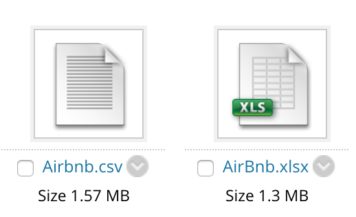

# Consumer Insights and Big Data
This repository contains all the needed information for the **Consumer Insights and Big Data** course that is:
  + Presentation material
  + Hands-on-lab instructions
  + Resources

> You can synchronise locally the repository using `Git` but **ONLY** its online version gets updated on regular basis, so if you do so, make sure to do regular pull requests to keep your local version synchronised.

---
## Agenda

> HOL = Hands-on-Labs  
Challenge = Individual work to be graded (accounts for xx% of overall grading)

**Part 1 - Descriptive Analytics (3 hours)**
+ Introduction (30 min)
    + Agenda, Pre-req & Objectives
    + Evaluation process
+ Descriptive Analytics with SPSS Statistics  (2h30)
    + Prez (30min)
    + [HOL - Data Preparation]()
    + [HOL - Data Viz]()
    + [HOL - Clustering / Classification]() (Use Case Marketing)
    + **Eval** - Quizz

**Part 2 - Descriptive Analytics (3 hours)**
+ Introduction to IBM Watson Studio (3 hours)
    + Guided tour of Watson Studio (30 min)
    + [HOL - Data Refinery](./Labs/Part2/Lab1.md) (45 min)
    + [HOL - Basic data Visualization](./Labs/Part2/Lab2.md) (45 min)
    + [HOL - Assembling a Dashboard](./Labs/Part2/Lab3.md) (45 min)
    + **Eval** - Quizz

**Part 3 - Predictive Analytics and Big Data & Analytics (3 hours)**
+ Big Data & Analytics - Factor of Digital Transformation (30 min)
+ Predictive Analytics with SPSS Modeler (45 min)
    + [HOL - 101]() (15 min)
+ Customer Analytics: Predictive Customer Intelligence, Churn Management, Next Best Action (30 min)
    + [HOL - Customer Analytics: Big Data & Analytics Questions]() (15 min)
    + [HOL - Churn Management (Classification Modelling)]() (30 min)
    + **Eval** - Quizz

**Part 4 - Predictive Analytics (3 hours)**  
+ Predictive modeling
    + [HOL - Product affinity]() (Association Modeling) (30 min)
    + [HOL - Next Best Action]() (Segmentation and Classification Modeling) (30 min)
+ Risk and Fraud Management (30 min)
    + [HOL - Risk and Fraud Management: Big Data & Analytics Questions]() (15 min)
    + [HOL - Suspicious cases]() (Anomaly Detection Modeling)
    + **Eval** - Quizz
    + **Eval** - Group Work kick-off

**Part 5 - Predictive Analytics with IBM Watson Studio (3 hours)**
+ IBM Data Science with IBM Watson Studio (30 min)
+ Modeler Flow (Classification Modeling) (30 min)
    + [HOL - Auto AI]() (30 min)
    + [HOL - Deep Learning]() (Neural Network) (30 min)
    + **Eval** - Quizz
    + **Eval** - Group Work mentoring (45 min)

**Part 6 - Prescriptive Analytics with Decision Optimization (3 hours)**
+ Introduction to Prescriptive Analytics (30 min)
    + [HOL - Solving a Planning and Scheduling Problem]() (45 min)
    + [HOL - The Diet Problem]() (45 min)
    + **Eval** - Quizz
    + **Eval** - Group Work mentoring (45 min)
---  
## Presentation material
All presentation material is posted [here](./Lectures).

## Hands-on-Labs
Hands-on-Lab instructions are available [here](./HOL_Overview.md)

---

## Grade and Assignment
You will be evaluate on the quality of a Business Report based on a case study. Your statement of work and the expectations are described in the following section.

### Challenges - Continuous grading

### Group work - Write a Business Report
#### Your mission
It does not matter whether you are using **SPSS Statistics**, **IBM Watson Studio**, or **SPSS Modeler** – the best way to learn data science is to learn the basics and then just start working a data science problem.
You are a marketing consultant team for **AirBnb** in charge of understanding customer satisfaction in Nice.  
Your mission in this project is to define an interesting marketing question(s) and provide informed recommendations based on data analytics.
You may explore the data in ways to identify trends, clusters, interesting outliers, interesting descriptive statistics, patterns and associations.  
You should draw **conclusions** on the best marketing actions to perform while highlighting the informed decisions that you recommend using analytics. As such, please do the following:
1.	Form a team (**groups of 6 people**, no individual work is accepted, neither groups of 1-5)
2.	Have a look at the data
3.	What could be possible marketing actions for Airbnb? Which business question can you answer in understanding customer satisfaction?
4.	Performing analyses on data
5.	Write a report

#### Your evaluation
Your group will be evaluated based on your capabilities of:
+	Understanding the business problem, the data provided to you and the insights you can find out of this dataset (What?)
+	Explore the actual characteristics and emerging patterns of the Airbnb marketplace in Nice.  (Why?)
+	Applying the methods used in class in his report.
+	Getting valuable insights for the recommended actions to improve customer satisfaction in Nice.

**The data needed for the evaluation is the AirBnb.csv file available in the /data folder of this repository**
[Link to the data - in GitHub](/data)
[Link to the data - in Blackboard](https://learning.edhec.edu/webapps/cmsmain/webui/courses/20_EB4_NI_BBM_S1_ECO_MKG_3226/TP_Consumers_Insights_and_Big_Data/CaseStudy?action=frameset&subaction=view&uniq=-mkcm69)

You should draw conclusions on the best marketing actions to perform while highlighting the informed decisions that you recommend using analytics. As the marketing consultant, you are in charge of assembling your findings in a shareable report-style document that anyone new to the use case should understand.

**Output format:** Please prepare your report in a pdf format. You need to add your output of your analysis to the appendix. Your report should be in between approximately `3500 words` long, and include figures and references, excluding the appendix.  

**Tools:** you’re free to use the tools we have presented (SPSS Statistics, IBM SPSS Modeler, IBM Watson Studio)
**Considerations:** you will be evaluated on your analytical approach to solve the business problem.
You are also free to refine, enrich the data the way you want if you find it useful to your study.
Always think of reusability: someone new to the use case with the similar data should be able to reproduce your study.
The report must be structured in the following way:
+ Title, authors, group
+	Executive Summary
+	Introduction
+	Problem Statement
+	Methodology
+	Findings
+	Discussion

Your grade will mostly rely on:
+	The approach and your group reasoning
+	The capability of answering complex questions in simple ways
+ The quality and effectiveness of analytical research
+	The quality and effectiveness of your communication

**Intellectual Property:** Your report will undergo a plagiarism check. Make sure you cite all your references and that your report is the result of your groups own unique work and not of someone else’s. Pursuant to EDHEC code of ethics, plagiarism constitutes a disciplinary violation and will results in a disciplinary procedure.
Questions
We are available to answer any of your questions:
+	Emmanuel Génard – genard@fr.ibm.com -
+ Yann Gouedo – yann.gouedo@fr.ibm.com

**Due date is *to be announced*, no delays. Send your report to your professor.**  

---
